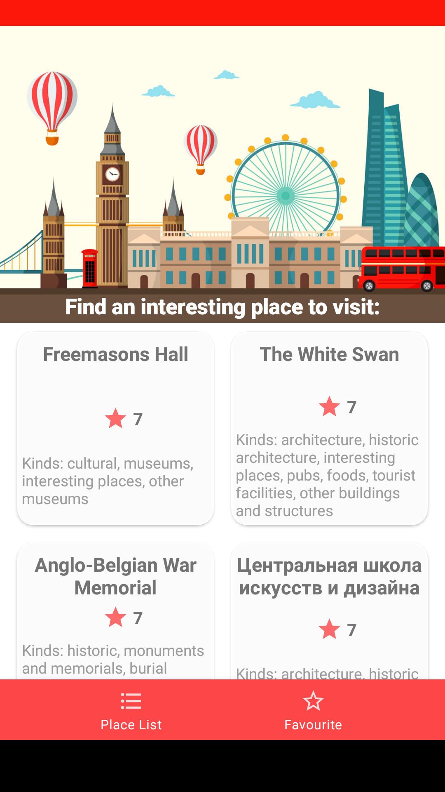
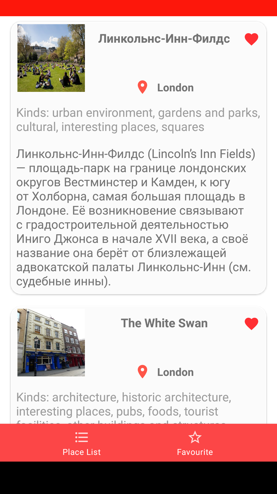

# London Eye
 London Eye App demonstrates information about popular sightseens in London
 
 | Main Screen | Detail info Screen | Favourite Screen |
| ------------- | ------------- |------------- |
|  |  | 

## Tech stack & Open-source libraries
* Minimum SDK level 23
#### 1. Architecture
* MVP Architecture
#### 2. Data
* Room
* Retrofit
#### 3. Base Structure
* Single Activity
* Fragments
* RxJava
* Moxy
#### 4. UI
* Glide
#### 5. DI
* Dagger
#### 6. Navigation
* Cicerone
________

### Open API
London Eye App using the open source api [OpenTripMap API](https://opentripmap.io/product)
